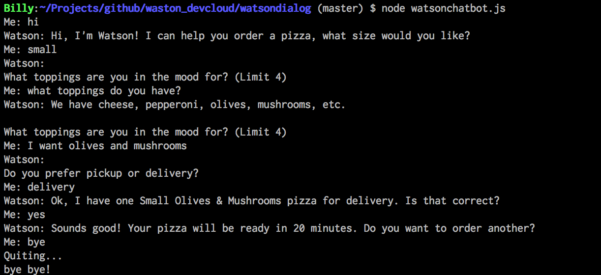

# watsondialog
A simple chatbot base on IBM Watson [Dialog service][service_url]

Install and run:

```sh
npm install
npm start
```
You may need to replace the ``username`` and ``password`` in the source code to your Bluemix service credentials to make sure you have a working demo.

Sample chat session:



[service_url]: http://www.ibm.com/smarterplanet/us/en/ibmwatson/developercloud/doc/dialog/
